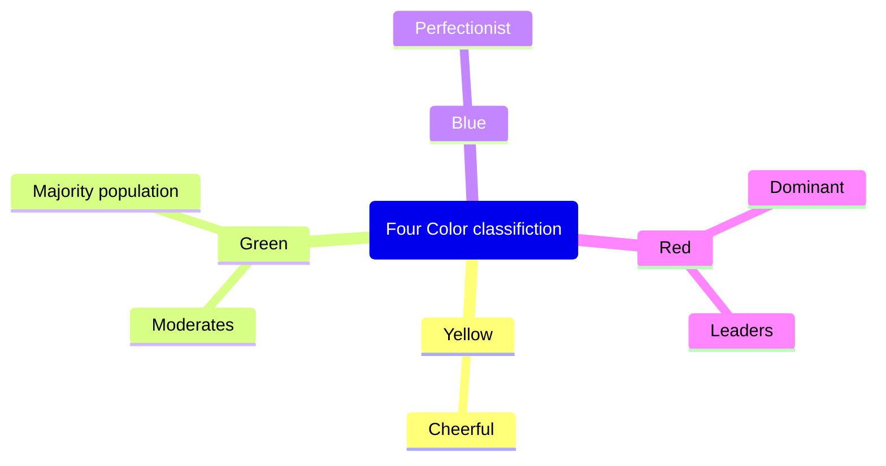

[<- Back to Index](../index.md)

# Surrounded By Idiots : *Thomas Erikson*
#### Summary 
```markdown
# Surrounded by Idiots: Summary

**Surrounded by Idiots** by Thomas Erikson is a practical guide to understanding human behavior and personality types using the DISC model. The book combines personality psychology with accessible humor and real-world examples to help readers navigate workplace dynamics and personal relationships.

## The Core Concept

Erikson argues that people often seem to act irrationally or frustratingly, but their behavior actually follows predictable patterns based on personality type. Rather than thinking everyone who disagrees with you is an idiot, the book proposes that most conflict stems from personality differences and miscommunication. By understanding these patterns, you can improve interactions and reduce unnecessary friction.

## The DISC Model

The book explains four primary personality types, each represented by a color:

**Red (Dominant)**: Direct, decisive, and results-oriented individuals who value efficiency and control. They're natural leaders but can come across as aggressive or insensitive. Reds want quick decisions and measurable outcomes.

**Yellow (Influence)**: Outgoing, enthusiastic, and people-focused personalities who thrive on social connection and recognition. They're creative and motivating but may struggle with details and follow-through. Yellows need positive interaction and acknowledgment.

**Green (Steadiness)**: Patient, loyal, and supportive individuals who prioritize harmony and stability. They're reliable team players but can be passive or resistant to change. Greens value predictability and personal relationships.

**Blue (Conscientiousness)**: Analytical, detail-oriented perfectionists who emphasize accuracy and quality. They're thorough and systematic but can be overly critical or indecisive. Blues need clear information and logical explanations.

## Key Insights

Erikson emphasizes that no personality type is better than another—they're simply different. Problems arise when people with different styles don't recognize or appreciate these differences. A Red manager might frustrate a Green employee by constantly pushing for change, while a Blue colleague might irritate a Yellow teammate with excessive questioning.

The book provides practical strategies for identifying personality types in others and adapting your communication style accordingly. This flexibility—not changing who you are, but adjusting how you interact—is central to the book's philosophy.

## Practical Applications

The second half focuses on real-world applications: conducting job interviews, managing teams, handling conflicts, and building better relationships. Erikson illustrates how misunderstandings between different personality types create workplace chaos, and how awareness can prevent them.

For example, a Red's blunt feedback might devastate a sensitive Green, while a Yellow's desire to socialize might annoy a focused Blue. Recognizing these tendencies allows for more empathetic communication.

## Strengths and Impact

The book's main strength is its accessibility. Rather than dense psychological theory, Erikson uses humor, dialogue, and relatable scenarios to explain personality dynamics. It's practical enough for immediate application—readers can start identifying and adapting to different personality types right away.

## Conclusion

**Surrounded by Idiots** suggests that most people aren't actually idiots; they simply operate from different priorities and perspectives. By recognizing personality differences through the DISC model, understanding others' motivations, and adapting communication accordingly, you can significantly improve relationships and reduce conflict at work and home. The book empowers readers to become more emotionally intelligent and effective communicators by seeing differences not as defects but as natural variation in human personality.
```

Book is about understanding peoples' behaviour. Mainly classify behaviour in four colours. Book says that people are often mix of few colours with some colour is dominant. 
This book also talks about which colour trait gels well with which colour.




## References 
* Website https://www.surroundedbyidiots.com/
* 
